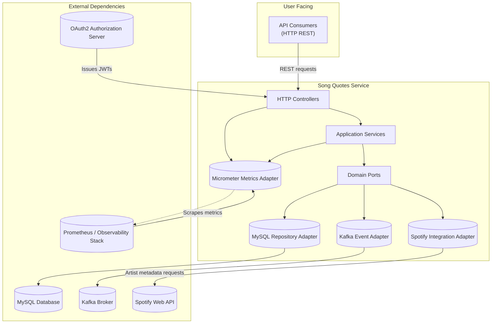

# Song Quotes Service Architecture

This document summarizes the high-level architecture of the Song Quotes Service and the dependencies it integrates with.

## Context

Song Quotes Service is a Spring Boot REST API that follows a hexagonal architecture. Requests enter through HTTP controllers, which delegate to application services implementing the core business logic. Outgoing communication is handled by infrastructure adapters that encapsulate persistence, messaging, metrics, and third-party integrations.

## High-level diagram

## Component responsibilities

- **HTTP Controllers** handle request/response translation and invoke the relevant application services.
- **Application Services** contain use-case logic and orchestrate domain operations.
- **Domain Ports** define contracts for persistence, external APIs, messaging, and metrics, enabling the hexagonal architecture.
- **MySQL Repository Adapter** implements persistence ports to store and retrieve quotes and artist data.
- **Kafka Event Adapter** publishes "quote created" events to downstream consumers.
- **Spotify Integration Adapter** enriches artists with metadata and top tracks from the Spotify Web API.
- **Micrometer Metrics Adapter** exposes operational metrics to Prometheus.
- **OAuth2 Authorization Server** provides JWT bearer tokens required for secured endpoints.
