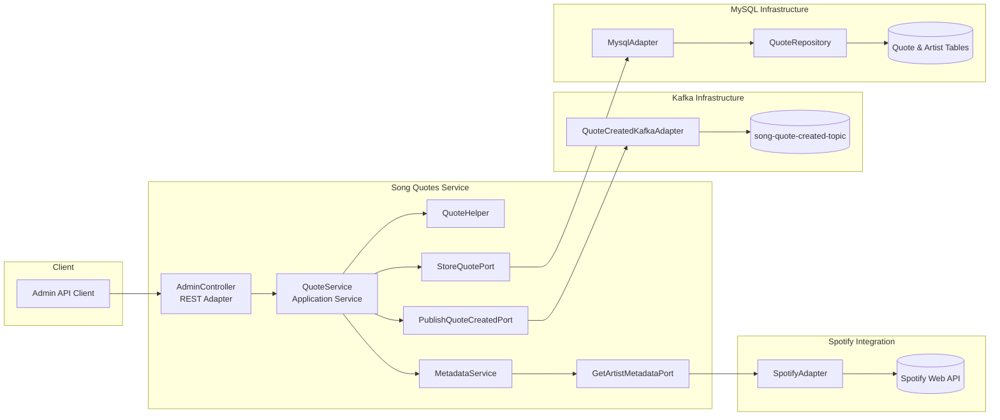
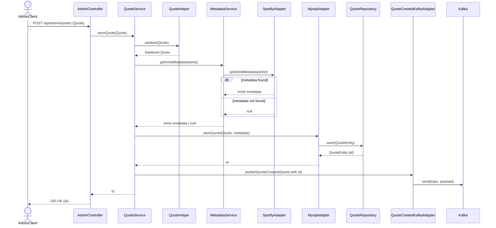

# Store Song Quote Use Case

This document details the flow for storing a new song quote through the administrative API. It builds on the high-level architecture overview by explaining the collaborating components, their responsibilities, and the messages exchanged when a quote is created.

## Overview

When an administrator submits a new quote, the request is validated and sanitized, metadata is optionally enriched via Spotify, the quote is persisted, and finally an integration event is emitted so downstream systems can react to the addition. The process follows the application's hexagonal architecture by routing all business logic through the `QuoteService` application service and delegating to ports for infrastructure concerns.

### Primary actors

- **Admin API Client** – trusted client that calls the administrative endpoint to create new quotes.
- **Song Quotes Service** – Spring Boot application providing application services and adapters.
- **MySQL** – persistent storage for quotes and cached artist metadata.
- **Kafka** – event bus for publishing "quote created" events to other services.
- **Spotify Web API** – external service queried for artist metadata enrichment.

## Component diagram

The following Mermaid component diagram highlights the logical building blocks involved in the store quote use case and how they collaborate.

## Detailed flow

1. The admin client sends an HTTP `POST /api/admin/quotes` request containing the quote payload to the `AdminController`.【F:src/main/java/com/xavelo/sqs/adapter/in/http/admin/AdminController.java†L32-L41】
2. `AdminController` delegates the request body to the `StoreQuoteUseCase`, implemented by `QuoteService`.【F:src/main/java/com/xavelo/sqs/adapter/in/http/admin/AdminController.java†L22-L41】【F:src/main/java/com/xavelo/sqs/application/service/QuoteService.java†L15-L67】
3. `QuoteService` sanitizes the payload through `QuoteHelper.sanitize`, ensuring blank fields are normalized and trimming whitespace. The sanitized quote is retained for downstream operations.【F:src/main/java/com/xavelo/sqs/application/service/QuoteService.java†L69-L84】【F:src/main/java/com/xavelo/sqs/application/service/QuoteHelper.java†L16-L35】
4. The service asks `MetadataService` to enrich the quote with artist metadata. `MetadataService` invokes the `GetArtistMetadataPort`, which is implemented by `SpotifyAdapter`. The adapter performs a search, fetches the artist profile, and loads top tracks from the Spotify Web API. If metadata cannot be resolved, `null` is returned and the process continues without enrichment.【F:src/main/java/com/xavelo/sqs/application/service/QuoteService.java†L80-L83】【F:src/main/java/com/xavelo/sqs/application/service/MetadataService.java†L17-L23】【F:src/main/java/com/xavelo/sqs/adapter/out/spotify/SpotifyAdapter.java†L27-L58】
5. `QuoteService` passes the sanitized quote and optional metadata to the `StoreQuotePort`. `MysqlAdapter` implements the port by mapping the domain object to a JPA entity and saving it through `QuoteRepository`. When artist metadata is available, it is stored alongside the quote and cached in the Spotify metadata tables.【F:src/main/java/com/xavelo/sqs/application/service/QuoteService.java†L81-L84】【F:src/main/java/com/xavelo/sqs/adapter/out/mysql/MysqlAdapter.java†L31-L73】
6. `MysqlAdapter` returns the generated quote identifier. `QuoteService` composes a domain `Quote` with the new ID and emits a `publishQuoteCreated` call to the Kafka adapter via the `PublishQuoteCreatedPort`. The adapter serializes the quote to JSON and publishes it to the `song-quote-created-topic` topic for other services to consume.【F:src/main/java/com/xavelo/sqs/application/service/QuoteService.java†L84-L93】【F:src/main/java/com/xavelo/sqs/adapter/out/kafka/QuoteCreatedKafkaAdapter.java†L12-L29】
7. Finally, `QuoteService` returns the quote ID to `AdminController`, which responds to the client with the identifier in the HTTP response body.【F:src/main/java/com/xavelo/sqs/application/service/QuoteService.java†L84-L93】【F:src/main/java/com/xavelo/sqs/adapter/in/http/admin/AdminController.java†L32-L41】

## Detailed sequence diagram

The sequence diagram below expands on the step-by-step interactions, including alternate paths for missing metadata and error handling boundaries.

## Error handling considerations

- If the Spotify API is unreachable or returns malformed data, `SpotifyAdapter` logs the error and returns `null`. The quote is still stored without enriched metadata, keeping the use case resilient.【F:src/main/java/com/xavelo/sqs/adapter/out/mysql/MysqlAdapter.java†L49-L73】【F:src/main/java/com/xavelo/sqs/adapter/out/spotify/SpotifyAdapter.java†L27-L58】
- Should Kafka serialization fail, the adapter throws a runtime exception, allowing standard Spring exception handling and retry policies to surface the problem to operators.【F:src/main/java/com/xavelo/sqs/adapter/out/kafka/QuoteCreatedKafkaAdapter.java†L22-L29】

## Result

The admin client receives the identifier of the newly created quote. Downstream consumers can subscribe to the `song-quote-created-topic` to react to new quotes, and enriched artist metadata is cached for subsequent requests.
